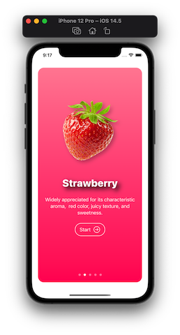
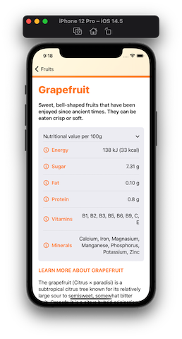
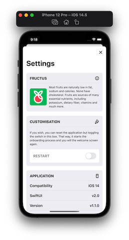

# Fructus

Easily view the nutritional information of many fruits and berries using the Fructus app.

## Features

List view for displaying fruits and berries.

Detailed fruit view for further information for a selected fruit or berry.

Settings screen for app information and returning to the onboarding screen.

## Requirements

To run the simulator, you will need Xcode, I use v12.5

## Demo

     

## Footnote

This app is apart of a course purchased on Udemy which you can find here [SwiftUI Masterclass](https://www.udemy.com/course/swiftui-masterclass-course-ios-development-with-swift/)
